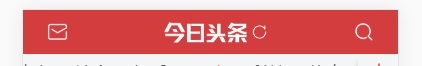

# 组件



封装一个头部组件

三个状态

props

||||
|-|-|-|
|左边是邮件logo|中间是文字|右边是搜索图标|
|返回logo|文字|无|
|无|文字|无|

- 让该组件呈现上面不同的状态，通过组件和props配合实现
- v-slot和slot插槽实现

logo来自于iconfont

```html
<my-header status="{
    left:true,
    title:'',
    right:false
}"></my-header>
```
```js
props:["status"]

this.status.left
this.status.title
this.status.right

template:``
```