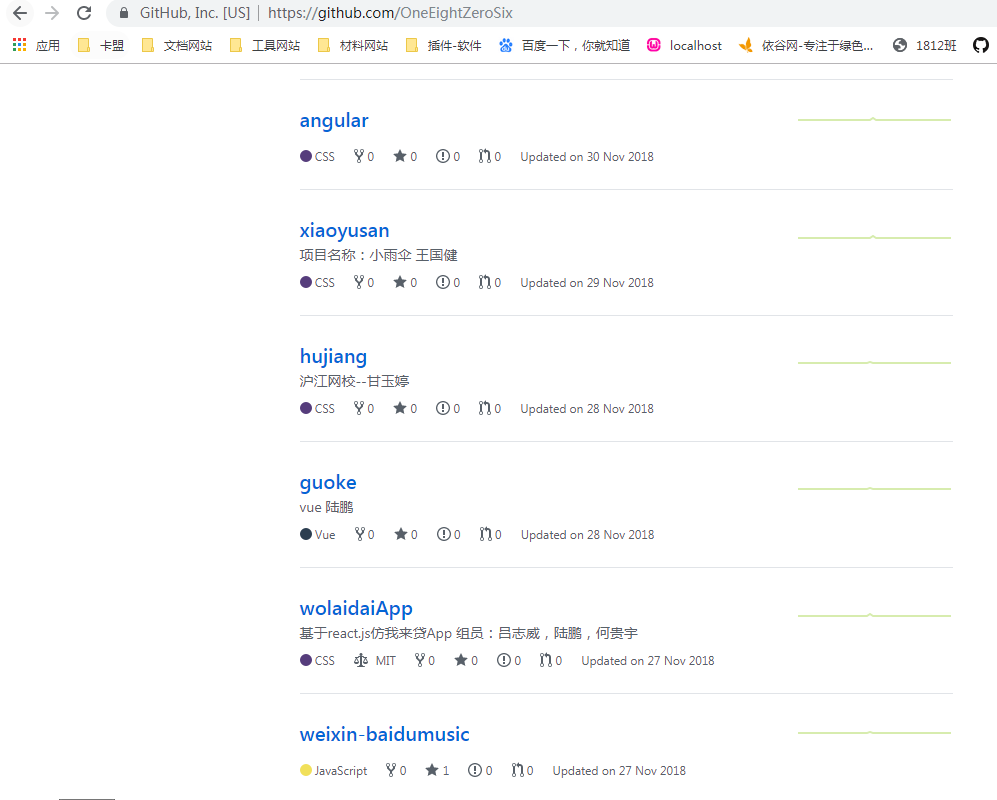

# Github账号

https://github.com/Wscats  姚一一(中文名)

等待我把你们所有人拉进去

你们每个人的邮箱会收到一封邮件(注意垃圾箱)，点击允许加入

# 创建仓库

开始写你的项目，把项目上传到github服务器上

先上传个人项目，测试

班长分配组

46

3人一组 

15组

一组多一个人

# 项目要求

- 个人项目
- 团队项目

移动端

- axios,vue,vuex,vue-router,es6,sass,vue-cli,vue-devtool

- easymock
- express mongodb mysql

- weui bootstrap mint elementui

金融，电商，外卖

PC端

后台管理系统